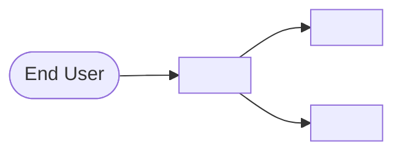
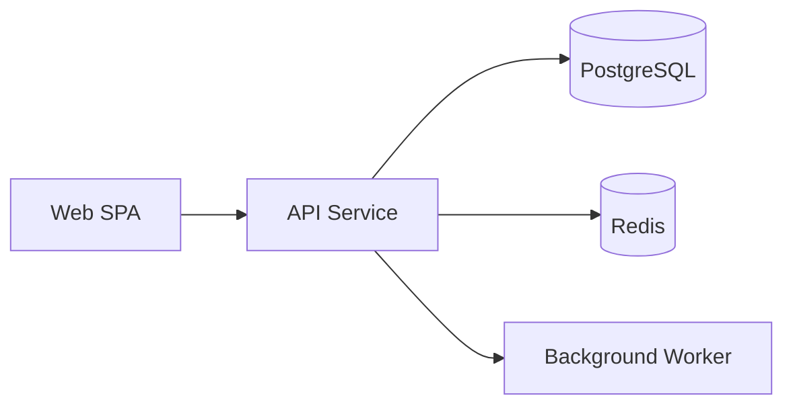

# <Product or Feature Name> — Technical Architecture Document

**Status:** Draft
**Owner:** <name>
**Last updated:** <YYYY-MM-DD>
**Source PRD:** <link>
**Source User Stories:** <link>

---

## 1. Context

<One paragraph: what we're building, what's in scope of this TAD, what's out of scope.>

## 2. System Context Diagram (C4 L1)

## 3. Components (C4 L2)

### 3.1 <Component name 1>

- **Responsibility:** <one sentence>
- **Stack:** <language, framework, key libs>
- **Inputs:** <what it consumes>
- **Outputs:** <what it produces>
- **Depends on:** <other components or external services>

### 3.2 <Component name 2>

- **Responsibility:** <…>
- **Stack:** <…>
- **Inputs:** <…>
- **Outputs:** <…>
- **Depends on:** <…>

## 4. Data Architecture

### Datastores

| Store | Holds | Why this store |
|---|---|---|
| <PostgreSQL> | <core relational entities> | <ACID, relational queries, team experience> |
| <Redis> | <session + hot cache> | <sub-ms reads> |

### Key entities

- **<Entity 1>** — <fields, relationships>
- **<Entity 2>** — <…>

### Data lifecycle

<Ingest → process → store → query → expire. Note retention, backfill, and migration strategy.>

## 5. Integrations

| External system | Direction | Protocol | Auth | Failure handling |
|---|---|---|---|---|
| <Okta SSO> | <out> | <OIDC> | <client credentials> | <fallback to local session> |
| <Stripe> | <out> | <REST> | <API key> | <retry with backoff, queue on persistent failure> |

## 6. Non-Functional Requirements

| Concern | Target | Notes |
|---|---|---|
| Latency (p95) | <200 ms> | <hot path: GET /dashboards/:id> |
| Throughput | <500 RPS sustained> | <peak: 1000 RPS> |
| Availability | <99.9%> | <monthly SLO> |
| Scale | <10k concurrent users, 1M dashboards> | <growth: 30% QoQ> |
| Accessibility | <WCAG 2.1 AA> | <full keyboard + screen reader> |

## 7. Security

- **Threat model summary:** <top threats — credential stuffing, IDOR, data exfiltration, etc. — and mitigations>
- **Authentication:** <SSO via Okta, MFA enforced>
- **Authorization:** <RBAC with roles: viewer, editor, admin>
- **Data classification:** <PII fields: email, name. Encrypted at rest with KMS-managed keys.>
- **Encryption:** <TLS 1.3 in transit, AES-256 at rest>
- **Audit:** <all writes logged to immutable audit store, 7-year retention>

## 8. Deployment

- **Environments:** <dev → staging → prod>
- **CI/CD:** <PR → checks → merge → auto-deploy to staging → manual promotion to prod>
- **Infra-as-code:** <Terraform>
- **Rollback:** <blue-green; previous version retained for 24h>

## 9. Observability

- **Metrics (SLIs):** <p95 latency, error rate, saturation per service>
- **Logs:** <structured JSON, sampled at 10% for INFO, 100% for ERROR>
- **Traces:** <OpenTelemetry, 1% sampling baseline, 100% for errors>
- **Alerts:** <pages on-call when SLO budget burn rate > 2x>

## 10. Failure Modes & Recovery

| Scenario | Detection | Response | RPO / RTO |
|---|---|---|---|
| <DB primary fails> | <RDS health check> | <auto-failover to replica> | <RPO: 5min, RTO: 2min> |
| <Cache stampede> | <miss rate spike> | <request coalescing + circuit breaker> | <n/a> |
| <Upstream API down> | <error rate alert> | <retry with backoff, then queue> | <eventual consistency> |

## 11. Open Questions & Risks

- <Open question 1>
- <Open question 2>
- **Risk:** <description> — **Mitigation:** <plan>

## 12. Decision Log (ADRs)

### ADR-001 — <Decision title>

**Status:** Accepted (<YYYY-MM-DD>)

**Context.** <Why we needed to decide; what constraints applied.>

**Decision.** <What we chose.>

**Alternatives considered.**
- <Alt 1> — rejected: <reason>
- <Alt 2> — rejected: <reason>

**Consequences.**
- (+) <positive consequence>
- (−) <trade-off accepted>

### ADR-002 — <…>
