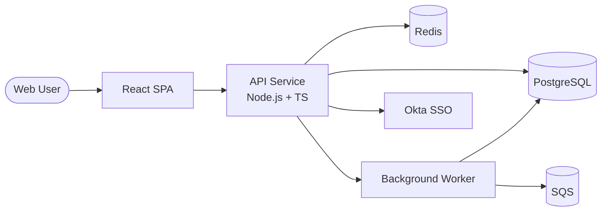

# Stage 4 — PRD + Stories → Technical Architecture Document

A TAD captures **how** the system is built — components, data, integrations, NFRs, deployment, security, observability. It is derived from the PRD (requirements) and Stories (concrete user-facing behaviours), and is the reference for everyone who builds, operates, or extends the system.

## Contents
- [Pre-requisites](#pre-requisites)
- [Inputs to gather before drafting](#inputs-to-gather-before-drafting)
- [Standard TAD structure](#standard-tad-structure)
- [Depth — how detailed?](#depth--how-detailed)
- [Diagrams (use C4-style)](#diagrams-use-c4-style)
- [Architecture Decision Records (ADRs)](#architecture-decision-records-adrs)
- [Drafting procedure](#drafting-procedure)
- [Quality bar](#quality-bar)
- [Common mistakes](#common-mistakes)

## Pre-requisites

- **PRD exists and has passed Stage 1 quality bar.** Re-read it before drafting — especially section 5 (success metrics) and section 7 (constraints).
- **User Stories exist with coverage of all must-have REQs.** A TAD written from REQs alone misses the user-facing nuance the stories surfaced.
- **Tech stack is confirmed.** If not, ask before drafting (see next section). Drafting against an inferred stack wastes effort when the user wanted something different.

## Inputs to gather before drafting

If the user did not specify, ask these 4–6 questions before drafting:

1. **Language / runtime** — e.g. Node.js+TS, Python, Go, Java.
2. **Primary datastore** — relational? document? KV? graph? Existing one we extend?
3. **Frontend** — SPA framework, SSR, mobile, none (API-only)?
4. **Host / infra** — AWS / GCP / Azure / on-prem / Vercel / Fly?
5. **Auth** — bring our own? OAuth provider? SSO requirement?
6. **Architectural style preference** — monolith, modular monolith, microservices, serverless? (Default to modular monolith unless stories clearly demand otherwise.)

Skip questions that the PRD already answers (e.g. if the PRD says "Must use existing PostgreSQL", do not re-ask about the datastore).

## Standard TAD structure

```
# <Product/Feature> — Technical Architecture Document

## 1. Context
   - One paragraph: what we're building, what's out of scope of this doc
   - Links to PRD and User Stories

## 2. System Context Diagram (C4 Level 1)
   - Boxes: this system, external users, external systems it talks to
   - Arrows: data flows with labels

## 3. Components (C4 Level 2)
   - Each major service / module:
     - Responsibility (one sentence)
     - Stack (language, framework, key libs)
     - Inputs / outputs
     - Depends on (other components or external)

## 4. Data Architecture
   - Datastores in use, what each holds, why chosen
   - Key entities and relationships (text or simple ERD)
   - Data lifecycle: ingest → process → store → query → expire
   - Migration / backfill strategy if applicable

## 5. Integrations
   - For each external system: purpose, direction, protocol, auth, error handling, retry policy

## 6. Non-Functional Requirements
   - Performance budgets (latency, throughput) with targets
   - Availability target + SLO
   - Scale assumptions (concurrent users, data volume, growth rate)
   - Accessibility (WCAG level, keyboard, screen reader)
   - Internationalization / localization if applicable

## 7. Security
   - Threat model summary (top 5 threats + mitigations)
   - Authn / authz model: who, what, how enforced
   - Data classification: what's PII, what's secret, where it lives
   - Encryption: in transit, at rest, key management
   - Audit logging: what's logged, retention, access

## 8. Deployment
   - Environments (dev / staging / prod)
   - CI/CD outline: from commit to prod
   - Infra-as-code approach (Terraform / Pulumi / CloudFormation / etc.)
   - Rollback strategy

## 9. Observability
   - Metrics: SLI list, where collected, dashboards
   - Logs: structured? sampling? retention?
   - Traces: distributed tracing yes/no, sampling rate
   - Alerts: which SLOs page on-call

## 10. Failure Modes & Recovery
   - Top 5 failure scenarios and the system's response to each
   - Backup / DR strategy and RPO/RTO targets

## 11. Open Questions & Risks
   - Unresolved technical questions
   - Known risks and mitigations

## 12. Decision Log (ADRs)
   - ADR-001: <decision>
   - ADR-002: <decision>
   (see ADR section below)
```

For a small feature, sections 7, 8, 9, 10 may be one paragraph each. Never skip 2, 3, 6.

## Depth — how detailed?

| PRD scope | TAD depth |
|---|---|
| Spike / POC | Sections 1–6 only, one paragraph each. Skip the rest. |
| Standard product feature | All sections, 1–3 paragraphs each. |
| Enterprise / regulated / multi-team | All sections at full depth, ADRs for every non-trivial choice, full threat model, capacity plan. |

Match TAD depth to PRD depth. A 50-page TAD on top of an 8-REQ PRD is theatre; an 8-paragraph TAD on top of a 60-REQ enterprise PRD is reckless.

## Diagrams (use C4-style)

Prefer text-based diagram syntax that lives in the same file as the markdown (Mermaid, PlantUML). Pictures rot the moment the architecture changes.

C4 levels worth including:

- **Level 1 — System Context** (always). Shows the system as a box, its users, and external systems.
- **Level 2 — Containers / Components** (always). Shows the major runtime components (web app, API, worker, DB, cache) and how they talk.
- **Level 3 — Component internals** (only when complex). Inside a single container, the modules and their interactions.

Skip level 4 (code-level). That belongs in the code, not in the TAD.

Example Mermaid block:

````

````

## Architecture Decision Records (ADRs)

For every non-trivial choice, record an ADR. Format:

```
### ADR-001 — Use PostgreSQL as primary datastore

**Status:** Accepted (YYYY-MM-DD)

**Context.** The product requires relational queries (dashboards joined to widgets joined to data sources) with ACID guarantees and < 50ms p95 read latency. Team has deep PostgreSQL experience; org runs managed PG on RDS.

**Decision.** Use PostgreSQL 16 on RDS, single primary with one read replica, schema-per-tenant for isolation.

**Alternatives considered.**
- MongoDB — rejected: no relational queries, weaker ACID, team would re-learn it.
- DynamoDB — rejected: hot-key risk at our access patterns, no joins.
- MySQL — rejected: no team experience, equivalent capabilities.

**Consequences.**
- (+) Familiar, well-understood ops story.
- (+) Native JSONB gives us flexibility for widget config blobs.
- (−) Per-tenant scaling requires careful schema management.
- (−) Read replica adds replication lag for read-after-write scenarios — must handle in app.
```

Record ADRs for choices like: datastore, queue/broker, language, deployment target, auth scheme, frontend framework, API style (REST/GraphQL/RPC), event vs. request-response, sync vs. async. Skip ADRs for choices that are obvious or follow org defaults.

## Drafting procedure

1. **Re-read the PRD and Stories.** Make a list of every non-functional requirement and every external system mentioned in stories.
2. **Confirm stack** (see inputs section). Do not draft against an inferred stack.
3. **Sketch the System Context and Components diagrams first.** They drive every other section. If you can't draw them, the architecture isn't clear enough yet.
4. **Fill sections 3–6** (components, data, integrations, NFRs) — these come directly from the diagrams and PRD.
5. **Fill sections 7–10** (security, deployment, observability, failure modes) — these are usually shorter, often referencing org defaults.
6. **Write ADRs for the 3–6 most consequential choices**. More than 6 is overkill for one TAD; fewer means decisions are hidden.
7. **List open questions explicitly.** Do not invent answers to fill gaps.
8. **Show the full TAD to the user.** Always — TAD review is high-leverage.

## Quality bar

Before showing the draft:

- [ ] Every NFR in the PRD is addressed somewhere in the TAD (usually section 6).
- [ ] Every external system mentioned in stories appears in section 5 (Integrations).
- [ ] At least one diagram. Both system context and components if complex.
- [ ] At least 3 ADRs for non-trivial choices.
- [ ] Failure modes section names specific scenarios, not "things might fail".
- [ ] Performance budgets have numbers (latency targets, throughput, RPS), not adjectives.
- [ ] Security section names the auth model and the data classification, not "we use auth".
- [ ] All Mermaid blocks parse (mentally walk through them — no orphan nodes, no cycles you didn't intend).

## Common mistakes

- **Inventing the stack.** Always confirm with the user before drafting. Wrong stack = wholesale rewrite.
- **Generating a TAD without reading the stories.** Misses concrete behaviours that drive integration and data choices.
- **All sections at uniform depth.** Match depth to product scope — over-engineered TADs are as bad as under-engineered ones.
- **No diagrams.** A TAD without at least a System Context diagram is hard to review.
- **No ADRs.** Decisions made silently get re-litigated forever. Capture the 3–6 most consequential.
- **Implementation detail in section 3.** Component descriptions should be one paragraph each — not a class diagram. Save code-level detail for the code.
- **Skipping failure modes.** Most TADs do; the ones that don't catch bugs at design review instead of in prod.
- **Vague NFRs.** "Should be fast" / "Should scale well" — same problem as in ACs. Always include numbers.
