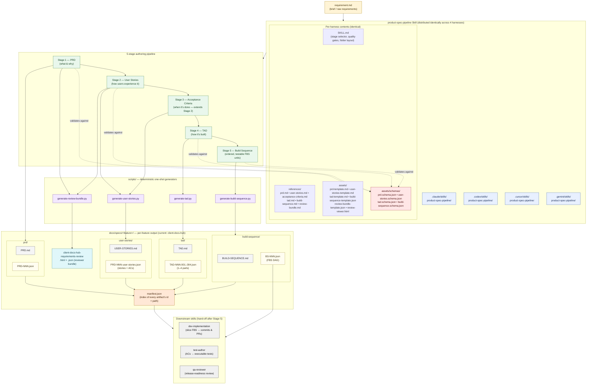

# Project architecture

This repo is a **product-spec pipeline**: an authoring system that turns a
plain-language brief into a stack of schema-validated specification artifacts
(PRD → User Stories → ACs → TAD → Build Sequence). The pipeline itself is
delivered as a Skill that is replicated across four agent harnesses
(`.claude`, `.codex`, `.cursor`, `.gemini`), backed by deterministic
generator scripts and JSON schemas, and writes its output into a per-feature
folder with per-stage subdirectories.

## How to read it

- **Yellow** — input brief.
- **Blue** — the Skill itself: prompt knowledge (SKILL.md + references),
  templates, and schemas. Replicated identically across the four harness
  directories so the same authoring behavior runs under Claude Code,
  Codex, Cursor, and Gemini.
- **Green** — the five authoring stages. Stage 3 (Acceptance Criteria)
  extends Stage 2's output in place rather than producing a new file.
- **Purple** — Python generators in `scripts/`. They author content as
  Python data structures, validate against the schemas, then emit both
  the markdown and the JSON mirrors so the two views stay byte-aligned.
- **Red** — JSON schemas. Every generated JSON document is validated
  against the matching schema before the stage is considered complete.
- **Cream / grey** — the per-feature output folder, with per-stage
  subdirectories (`prd/`, `user-stories/`, `tad/`, `build-sequence/`).
  Each stage folder holds the markdown + JSON pair side-by-side.
- **Orange** — `manifest.json`, the per-feature index that downstream
  tooling reads to discover every artifact without filename guessing.
- **Teal** — the reviewer bundle (an HTML viewer + JSON state) derived
  from the PRD and User Stories so non-technical reviewers can mark
  REQs and ACs as reviewed without touching the source artifacts.
- **Grey (right)** — the downstream skills the pipeline hands off to
  after Stage 5: `dev-implementation` (implementation slicing),
  `test-author` (writing the executable tests for each AC), and
  `qa-reviewer` (release-readiness review).

## Key invariants

1. **Dual output per stage.** Every stage emits both markdown (for human
   review) and JSON (for tooling). Neither is shipped without the other.
2. **JSON is canonical.** When the two diverge, the JSON wins —
   downstream stages always read the JSON, never the markdown.
3. **Schema-gated.** No JSON file leaves a stage until it validates
   against `assets/schemas/<stage>.schema.json`.
4. **One feature folder, per-stage subdirectories.** All artifacts for
   a feature live under `docs/specs/<feature>/`, split into `prd/`,
   `user-stories/`, `tad/`, and `build-sequence/` subfolders. The
   manifest is the only file at the feature-folder root (alongside the
   reviewer bundle).
5. **Identifier conventions.** IDs follow strict regexes
   (`PRD-NNN`, `REQ-NNN`, `US-NNN`, `AC-NNN`, `ADR-NNN`, `TAD-NNN-NNN`,
   `BS-NNN`, `FBS-NNN`) so cross-references between stages are stable.
6. **Build Sequence is a DAG.** Every `FBS` covers ≥ 1 AC, every AC is
   covered by exactly one FBS, and `dependencies[]` between FBS units
   form a directed acyclic graph.
