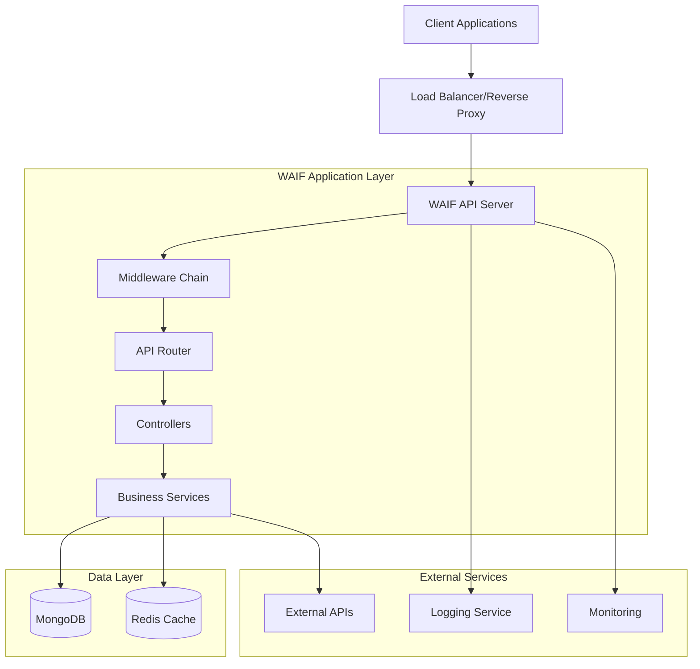
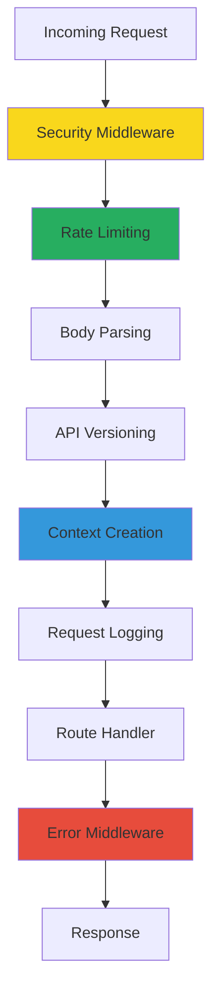
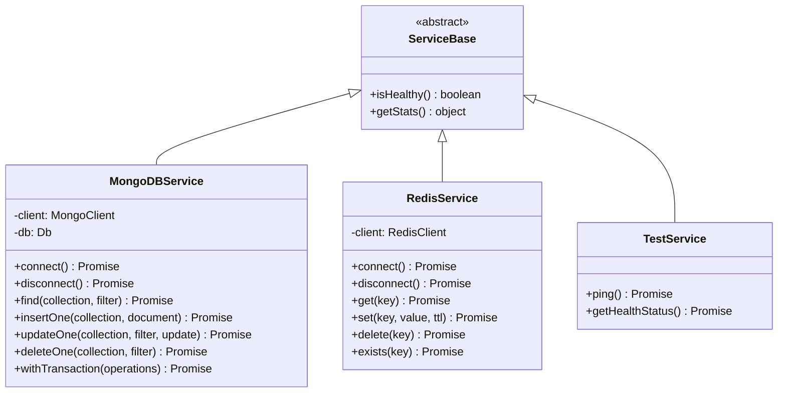
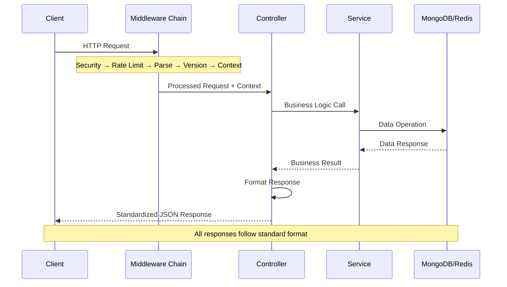
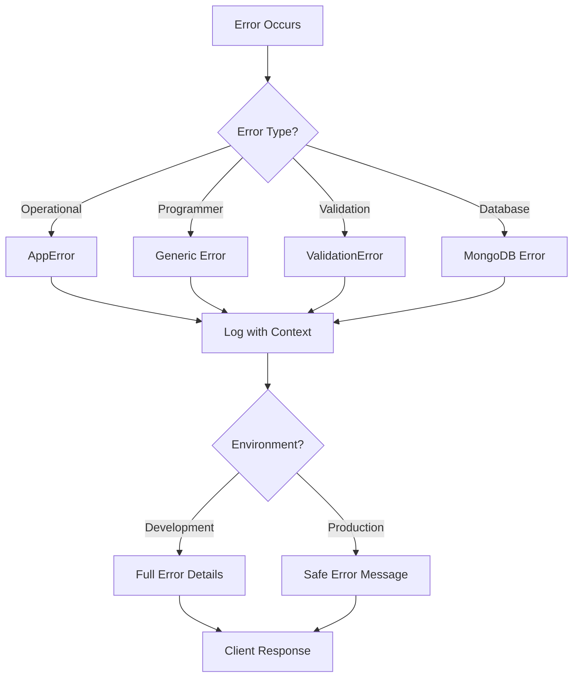

<!-- File: /docs/architecture/README.md -->
<!-- Last Updated: 2024-12-05 -->
<!-- Status: current -->

# WAIF Framework Architecture

## Architecture Overview

WAIF (Web Application Integration Framework) implements a layered architecture with strict separation of concerns, optimized for scalability, maintainability, and developer experience.

## High-Level Architecture



## Middleware Chain Architecture

The middleware chain follows a strict order that MUST be maintained:



### Middleware Components

1. **Security Layer** (`src/api/v1.0/middleware/security/`)
   - Helmet.js for HTTP security headers
   - CORS configuration with environment-based origins
   - Rate limiting with Redis backend

2. **Core Processing** (`src/api/v1.0/middleware/core/`)
   - Body parsing with size limits
   - API version resolution from headers
   - Request context creation with correlation IDs
   - Structured request/response logging

3. **Error Handling** (`src/api/v1.0/middleware/core/error.middleware.js`)
   - Operational vs programmer error distinction
   - Environment-aware error responses
   - Comprehensive error logging

## Service Layer Architecture



### Service Patterns

1. **Singleton Pattern**: All services implement singleton pattern for resource efficiency
2. **Connection Pooling**: MongoDB and Redis use connection pooling
3. **Health Monitoring**: All services expose health status and statistics
4. **Error Handling**: Consistent error patterns with retry logic
5. **Transaction Support**: MongoDB service supports ACID transactions

## Request/Response Flow



### Response Format Standards

All API responses follow these formats (defined in `src/utils/response.handler.js`):

```javascript
// Success Response
{
  "status": "success",
  "message": "Request completed successfully",
  "data": { /* response data */ }
}

// Error Response
{
  "status": "error", 
  "message": "Descriptive error message",
  "statusCode": 400,
  "requestId": "uuid-v4-request-id"
}

// Paginated Response
{
  "status": "success",
  "message": "Data retrieved successfully", 
  "data": [ /* array of items */ ],
  "meta": {
    "pagination": {
      "page": 1,
      "limit": 10,
      "total": 100,
      "pages": 10
    }
  }
}
```

## Database Architecture

### MongoDB Configuration

- **Connection Pooling**: Configurable pool size (default: 10)
- **Replica Set Support**: Primary/secondary read preference
- **Transaction Support**: ACID transactions for multi-document operations
- **Index Strategy**: Automatic index creation with migrations
- **Connection Resilience**: Automatic reconnection with exponential backoff

### Redis Configuration  

- **JSON Serialization**: Automatic JSON handling with circular reference protection
- **Key Prefixing**: Environment-based key prefixes (`waif:dev:`)
- **TTL Management**: Configurable time-to-live for cached data
- **In-memory Fallback**: Development mode fallback when Redis unavailable
- **Connection Resilience**: Health checks with automatic retry

## Error Handling Architecture



### Error Categories

1. **Operational Errors** (`AppError` with `isOperational: true`)
   - User input validation failures
   - Network connectivity issues
   - External API failures
   - Resource not found scenarios

2. **Programmer Errors** (Unexpected errors)
   - Code bugs and logic errors
   - Missing dependencies
   - Configuration errors
   - Type errors

## Security Architecture

### Implemented Security Layers

1. **HTTP Security Headers** (Helmet.js)
   - Content Security Policy (CSP)
   - HTTP Strict Transport Security (HSTS)
   - X-Frame-Options, X-Content-Type-Options
   - Referrer Policy controls

2. **CORS Configuration**
   - Environment-specific allowed origins
   - Credential handling configuration
   - Pre-flight request support

3. **Rate Limiting**
   - Redis-backed distributed rate limiting
   - IP-based request throttling
   - Configurable limits per endpoint
   - In-memory fallback for development

4. **Input Validation**
   - Request size limits (10MB default)
   - Content type validation
   - JSON parsing error handling

## Performance Architecture

### Optimization Strategies

1. **Connection Pooling**
   - MongoDB connection pools (max: 10)
   - Redis connection reuse
   - HTTP keep-alive support

2. **Caching Strategy**
   - Redis for application data caching
   - OpenAPI specification caching (5 minutes)
   - In-memory fallbacks for development

3. **Logging Optimization**
   - Structured JSON logging with Pino
   - Async logging to prevent blocking
   - Log level filtering by environment

4. **Resource Management**
   - Graceful shutdown handling
   - Memory leak prevention
   - CPU profiling capabilities

## Monitoring and Observability

### Health Monitoring

- **Health Endpoints**: `/health` for application status
- **Service Health**: Individual service health checks
- **Database Statistics**: Connection pool and query metrics
- **Redis Statistics**: Connection status and key metrics

### Logging Strategy

- **Structured Logging**: JSON format with Pino
- **Request Tracing**: Correlation IDs for request tracking
- **Error Context**: Full error context with stack traces
- **Performance Metrics**: Request duration and response times

## Deployment Architecture

### Container Strategy

- **Multi-stage Docker builds**: Optimized production images
- **Service orchestration**: Docker Compose for local development
- **Environment isolation**: Separate configurations per environment
- **Health checks**: Container-level health monitoring

### CI/CD Pipeline

- **Automated Testing**: Unit and integration test suites
- **Code Quality**: ESLint and Prettier enforcement
- **Security Scanning**: npm audit and container vulnerability checks
- **Artifact Generation**: Automated Docker image building

## Scalability Considerations

### Horizontal Scaling

- **Stateless Design**: No server-side session state
- **Database Scaling**: MongoDB replica sets and sharding
- **Cache Distribution**: Redis cluster support
- **Load Balancing**: Multiple API server instances

### Vertical Scaling

- **Resource Optimization**: Memory and CPU profiling
- **Connection Tuning**: Database connection pool sizing
- **Query Optimization**: Index strategy and query analysis

## Related Documentation

- [System Design Details](./system-design.md)
- [Data Flow Documentation](./data-flow.md)
- [Security Architecture](./security.md)
- [Scalability Guide](./scalability.md)
- [Architecture Decision Records](./decisions/)
